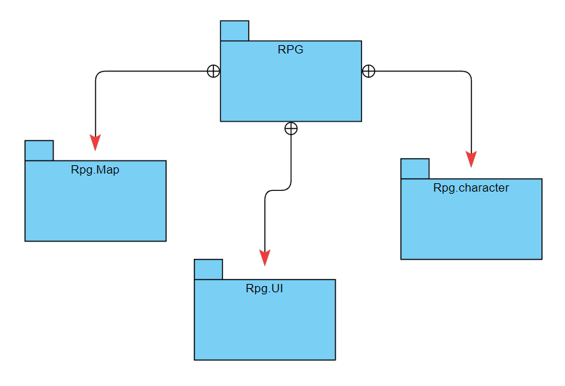
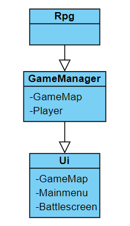
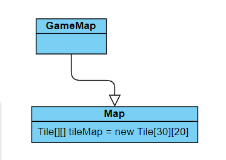

# Arkkitehtuurikuvaus

## Rakenne
Ohjelmassa on neljä erillaista pakettia

rpg pitää sisällään gamemanagerin, rpg.character pitää sisällään hahmoluokat, rpg.map pitää sisällään kartan luomiseen tarkoitetut komponentit ja rpg.ui pitää sisällään graafiset jutut.
## Käyttöliittymä
Käyttöliittymän eri näkymät näkyvät vain yksi kerrallaan.
Niitä on kolmea erillaista ne ovat:
- Menunäkymä
- Karttanäkymä
- Taisteluruutu
Eri näkymät ovat omia luokkiaan ja niiden näyttämisestä vastaa Ui
## Sovelluslogiikka
Sovelluslogiikasta vastaa GameManager luokka. GameManager syötteiden perusteella kertoo ui-luokalle mitä pitää näyttää ja missä kohtaa.

## Ohjelman rakenteeseen jääneet heikkoudet
-Ohjelmassa on isoja "nested iffejä" jotka tekevät ohjelman lukemisesta hankalaa, sekä ohjelman fuktiot veyvät parissa kohtaan todellä pitkiksi.

-Karttanäkymä oli erityisen huonosti tehty koska kartan piirtämisestä vastaava luokkaa luo Mmap luokan joka vastaa kartanpiirtämisen logiikasta. Siinä luetaan sisään .txt tyyppinen tiedosto jonka perusteella tehdään "Tilemap" jonka perusteella kartta piirretään.
